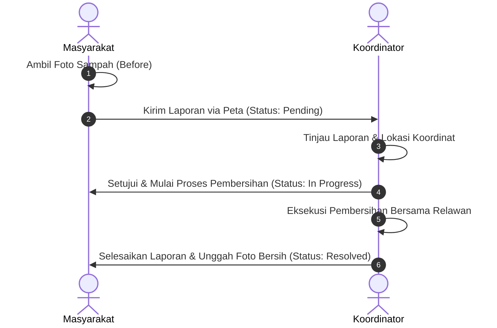
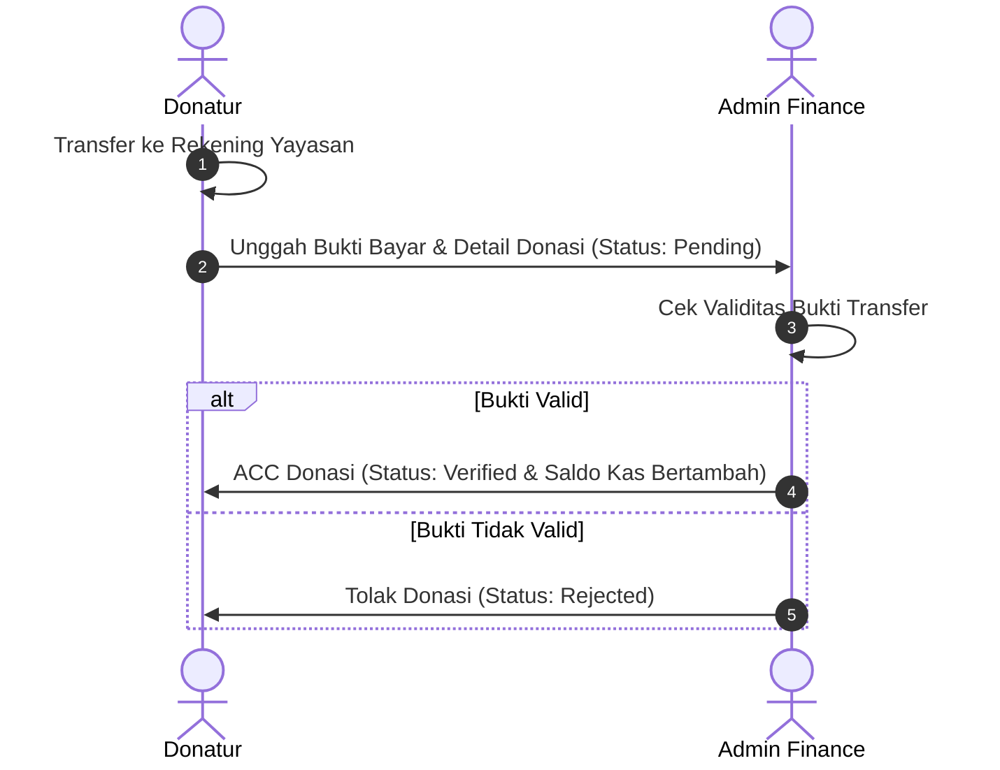

# SocialAct - Platform Aksi Sosial & Transparansi Donasi

**SocialAct** adalah aplikasi berbasis web yang dirancang untuk memudahkan masyarakat dalam melaporkan tumpukan sampah, berpartisipasi sebagai relawan, serta memantau transparansi pengelolaan keuangan aksi sosial secara terbuka. Sistem ini menghubungkan **Masyarakat (Publik/Donatur/Pelapor)** dengan **Tim Administrator (Super Admin, Keuangan, dan Koordinator Lapangan)** untuk menciptakan lingkungan yang lebih bersih dan transparan.

Aplikasi ini dibangun menggunakan **PHP CodeIgniter 3** dengan basis data **MySQL/MariaDB** dan dipercantik menggunakan **Tailwind CSS** (via CDN) sehingga responsif dan modern.

---

## 🌟 Fitur Utama

Sistem SocialAct dibagi menjadi 4 hak akses dan peran utama:

### 1. Sisi Publik / Pengunjung (Masyarakat)
* **Pelaporan Sampah Mudah**: Melaporkan lokasi tumpukan sampah dengan menyertakan nama pelapor, deskripsi, alamat detail, koordinat peta, dan unggah foto kondisi sebelum dibersihkan (`image_before`).
* **Peta Interaktif (Leaflet.js GIS)**: Menampilkan peta sebaran titik laporan penumpukan sampah secara real-time berdasarkan koordinat Latitude dan Longitude.
* **Before-After Image Slider**: Slider interaktif di halaman detail laporan untuk membandingkan kondisi sampah sebelum dan sesudah dilakukan aksi pembersihan.
* **Transparansi Keuangan Real-Time**: Halaman grafik & tabel rincian donasi masuk dan pengeluaran dana operasional secara terbuka untuk menjaga akuntabilitas.
* **Donasi Terbuka**: Pengiriman donasi dengan mengunggah bukti transfer, memilih rekening tujuan, serta opsi menyembunyikan nama (Anonim / Hamba Allah).
* **Pendaftaran Relawan (Volunteer Hub)**: Mengajukan diri menjadi relawan dalam event kebersihan lingkungan yang diselenggarakan oleh koordinator lapangan.

### 2. Sisi Admin Keuangan (Role `finance`)
* **Dashboard Finansial**: Memantau ringkasan saldo kas, total donasi masuk, total pengeluaran, serta grafik kategori pengeluaran.
* **Verifikasi Donasi Masuk**: Meninjau bukti transfer yang diunggah donatur untuk disetujui (*Verified* - saldo bertambah otomatis) atau ditolak (*Rejected*).
* **Manajemen Rekening Kas (CRUD)**: Menambahkan dan memperbarui bank/e-wallet penampung donasi (BCA, Gopay, dll.) serta saldo awalnya.
* **Pencatatan Transaksi Pengeluaran**: Mencatat pengeluaran uang kas dengan mengunggah bukti kuitansi (`receipt_image`) dan foto dokumentasi kegiatan/barang (`item_image`).
* **Filter Laporan Keuangan**: Menyaring riwayat pengeluaran kas berdasarkan rentang tanggal tertentu.

### 3. Sisi Koordinator Lapangan (Role `field_coordinator`)
* **Dashboard Laporan & Event**: Panel pemantauan aduan sampah yang masuk serta agenda event volunteer yang aktif.
* **Manajemen Status Laporan Sampah**:
  * Mengubah status laporan dari *Pending* ke *In Progress* saat aksi pembersihan dimulai.
  * **Resolve Laporan**: Menyelesaikan laporan dengan mengunggah bukti foto kondisi lokasi setelah dibersihkan (`image_after`).
  * **Reject Laporan**: Menolak laporan yang tidak valid atau palsu.
* **Manajemen Event Volunteer (CRUD)**: Membuat, mengedit, dan menghapus agenda kegiatan aksi bersih-bersih lingkungan lengkap dengan unggah foto banner.
* **Detail Relawan Terdaftar**: Melihat data lengkap relawan (kontak, domisili, motivasi) yang mendaftar pada setiap event.

### 4. Sisi Super Admin (Role `super_admin`)
* **Dashboard Admin**: Panel monitoring global jumlah pengguna admin, total saldo, event volunteer, dan laporan sampah masuk.
* **Manajemen Akun Administrator (CRUD)**:
  * Membuat akun administrator baru (Finance, Field Coordinator, Super Admin) dengan enkripsi password menggunakan `password_hash()` (BCRYPT).
  * Menghapus akun admin lama (dengan proteksi keamanan diri sendiri).

---

## 🛠️ Teknologi yang Digunakan

* **Core Framework**: PHP CodeIgniter 3.x
* **Database**: MySQL / MariaDB
* **Styling & CSS**: Tailwind CSS (via CDN)
* **Interactive Map**: Leaflet.js (GIS mapping)
* **Charts**: Chart.js
* **Icons**: FontAwesome v6
* **Typography**: Inter & Oswald (Google Fonts)

---

## 📁 Struktur Proyek

Struktur folder utama aplikasi ini mengikuti arsitektur MVC (Model-View-Controller) bawaan CodeIgniter:

```text
socialact/
├── application/
│   ├── config/            # Konfigurasi aplikasi (database, routes, autoload, dll.)
│   ├── controllers/       # Logika bisnis & navigasi utama
│   │   ├── Admin.php      # Controller panel Super Admin & penentu rute dashboard
│   │   ├── Auth.php       # Controller untuk Autentikasi (Login, Logout, proses verifikasi)
│   │   ├── Content.php    # Controller untuk Field Coordinator (Laporan & Event)
│   │   ├── Finance.php    # Controller untuk Finance Admin (Transaksi & Verifikasi)
│   │   └── Web.php        # Controller utama halaman publik (Landing Page, Donasi, Lapor, Volunteer)
│   ├── models/            # Interaksi database
│   │   ├── Admin_model.php# Model query data admin
│   │   ├── App_model.php  # Query halaman publik (Saldo, Donasi, Laporan, Event)
│   │   ├── Content_model.php # Query khusus laporan lapangan & event volunteer
│   │   ├── Finance_model.php # Query pengelolaan saldo, rekening, dan transaksi pengeluaran
│   │   └── Super_model.php# Query monitoring global & pendaftaran admin
│   └── views/             # File antarmuka / UI (.php templates)
│       ├── admin/         # View dashboard masing-masing role admin
│       ├── auth/          # View halaman login admin
│       ├── content/       # View halaman publik (lapor, donasi, transparansi, dll.)
│       └── layout/        # Template master layout layout (main & admin)
├── uploads/               # Direktori penyimpanan media (file upload)
│   ├── donations/         # File bukti transfer dari donatur
│   ├── events/            # Banner gambar event volunteer
│   ├── expenses/          # Foto nota/kuitansi & dokumentasi barang pengeluaran
│   └── reports/           # Foto aduan sampah sebelum & sesudah dibersihkan
├── social_impact_db (3).sql # SQL Database dump
└── index.php              # Entry point utama aplikasi
```

---

## 🗄️ Skema Database (`social_impact_db`)

Aplikasi ini menggunakan 7 tabel utama yang saling berelasi:

1. **`accounts`**: Menyimpan informasi rekening bank / e-wallet kas yayasan.
2. **`admins`**: Menyimpan data akun pengelola sistem (Super Admin, Finance, Field Coordinator).
3. **`donations`**: Menyimpan riwayat donasi masuk, bukti transfer, dan status verifikasi.
4. **`expenses`**: Menyimpan pencatatan pengeluaran dana kas untuk aksi sosial beserta bukti kuitansi.
5. **`volunteer_events`**: Menyimpan agenda kegiatan aksi bersih-bersih lingkungan yang direncanakan.
6. **`volunteers`**: Menyimpan daftar relawan yang mendaftar pada agenda kegiatan tertentu.
7. **`waste_reports`**: Menyimpan titik laporan tumpukan sampah, koordinat Leaflet, foto *before-after*, dan status.

### Relasi Antar Tabel:
* Transaksi **Donations** mencatat tujuan rekening (`donations.account_id` -> `accounts.id`) dan admin yang memverifikasinya (`donations.verified_by` -> `admins.id`).
* Transaksi **Expenses** mencatat dari rekening mana saldo dipotong (`expenses.account_id` -> `accounts.id`) dan admin finance yang menginputnya (`expenses.created_by` -> `admins.id`).
* Relasi pendaftaran **Volunteers** mengacu ke event yang diikuti (`volunteers.event_id` -> `volunteer_events.id`).

---

## 🚀 Panduan Instalasi di Localhost

Ikuti langkah-langkah di bawah ini untuk menjalankan proyek ini di komputer Anda menggunakan XAMPP:

### 1. Prasyarat
Pastikan Anda sudah menginstal aplikasi berikut:
* **XAMPP** (disarankan dengan PHP 7.4 s.d. 8.0)
* Web Browser (Chrome, Edge, Firefox, dll.)

### 2. Langkah-Langkah Setup
1. **Salin Proyek**:
   Pindahkan folder `socialact` ke dalam direktori server lokal Anda:
   * Windows: `C:\xampp\htdocs\socialact`
   * Linux: `/opt/lampp/htdocs/socialact`
   
2. **Import Database**:
   * Jalankan **Apache** dan **MySQL** di XAMPP Control Panel.
   * Buka browser dan pergi ke halaman [http://localhost/phpmyadmin](http://localhost/phpmyadmin).
   * Buat database baru dengan nama `social_impact_db`.
   * Pilih database `social_impact_db`, pergi ke tab **Import**, klik **Choose File**, pilih file `social_impact_db (3).sql` di root proyek ini, lalu klik **Go** / **Import**.

3. **Konfigurasi Database**:
   Buka file `application/config/database.php` menggunakan text editor, sesuaikan pengaturan kredensial database Anda (default bawaan XAMPP biasanya seperti di bawah ini):
   ```php
   $db['default'] = array(
       'dsn'	   => '',
       'hostname' => 'localhost',
       'username' => 'root',
       'password' => '',
       'database' => 'social_impact_db',
       'dbdriver' => 'mysqli',
       // ... konfigurasi lainnya
   );
   ```

4. **Konfigurasi Base URL**:
   Buka file `application/config/config.php` lalu sesuaikan `base_url` proyek Anda:
   ```php
   $config['base_url'] = 'http://localhost/socialact/'; // Sesuaikan dengan path folder Anda di htdocs
   ```

5. **Jalankan Aplikasi**:
   Buka browser Anda dan akses aplikasi melalui alamat base URL yang dikonfigurasi di atas, contoh:
   ```text
   http://localhost/socialact/
   ```

---

## 🔑 Akun Demo (Bawaan Database)

Anda dapat menggunakan akun-akun demo berikut yang sudah ada dalam database untuk menguji fitur aplikasi:

| Peran (Role) | Email | Password | Keterangan |
|---|---|---|---|
| **Super Admin** | `super@social.org` | `password` | Hak akses penuh mengelola akun administrator lain |
| **Finance Admin** | `finance@social.org` | `password` | Mengelola transaksi pengeluaran & verifikasi donasi masuk |
| **Field Coordinator** | `content@social.org` | `password` | Mengelola status laporan sampah & pendaftaran event relawan |

---

## 🔄 Alur Kerja Sistem

Berikut adalah visualisasi alur kerja utama penanganan aduan sampah dan verifikasi donasi di platform SocialAct:

### 1. Alur Penanganan Laporan Sampah (GIS & Cleanup)


### 2. Alur Penerimaan & Verifikasi Donasi


---